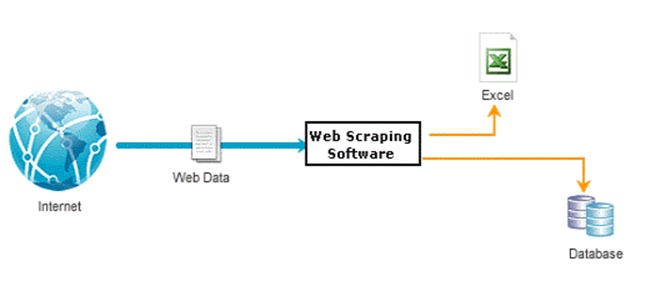

# 🕷 Projeto de Web Scraping 👨‍💻

## 📍 Definiçao
Crawler, também conhecido como spider ou bot, refere-se a um programa automatizado que navega pela internet de forma metódica e sistemática.
O crawler é uma parte essencial do scraping, pois ajuda a encontrar e acessar as páginas, mas o scraping em si é o processo de extração dos dados dessas páginas identificadas.


## 📝 Índice
- [🕷 Projeto de Web Scraping 👨‍💻](#-projeto-de-web-scraping-)
  - [📝 Índice](#-índice)
  - [🔎 Descrição](#-descrição)
  - [🎯 Aplicação Social](#-aplicação-social)
  - [📌 Comprovação do problema escolhido](#-comprovação-do-problema-escolhido)
  - [⚙ Funcionalidades](#-funcionalidades)
  - [⏩ Como Usar](#-como-usar)
  - [🛠 Arquitetura do Sistema:](#-arquitetura-do-sistema)
  - [🪜 Estrutura do projeto:](#-estrutura-do-projeto)
  - [Referências](#referências)
  - [📋 Notas](#-notas)
  - [💼 Autores](#-autores)


## 🔎 Descrição

Este é um projeto de web scraping desenvolvido para coletar dados específicos de um site da web. O web scraper é projetado para extrair informações de [AirBnb](https://www.airbnb.com.br/) e armazená-las em um formato estruturado para análise posterior.


## 🎯 Aplicação Social

Acreditamos que o acesso à informação é fundamental para promover a equidade no mercado. Ao disponibilizar preços atualizados e detalhes sobre aluguel temporário em várias regiões, nossa aplicação empodera os usuários a tomarem decisões mais informadas e conscientes sobre suas escolhas de hospedagem, facilitando a comparação de preços e a identificação de oportunidades de economia através planilhas.


## 📌 Comprovação do problema escolhido

Atualmente ao acessar o site https://www.airbnb.com.br/ e tentarmos organizar dados manualmente em uma planilha, é inviável. Essa comprovação baseia-se em pesquisas, coleta de dados e interação como usuário. Para comprovar que a tarefa manual de organizar dados em uma planilha é inviável e limitada em vários aspectos. Os principais desafios que identificamos incluem:

1. **Volume de dados**: Com o aumento exponencial da quantidade de informações de alugueis disponíveis diariamente, torna-se praticamente impossível analisar e organizar cada dado manualmente, especialmente em grandes conjuntos de dados.

2. **Tempo e esforço**: A organização manual demanda um tempo considerável e esforço humano, o que pode levar a atrasos, erros e ineficiência geral no processo. Além disso, o tempo gasto na organização manual de dados poderia ser direcionado para outras questões mais valiosas.

3. **Suscetibilidade a erros**: O processo manual está sujeito a erros humanos, como digitação incorreta, interpretação equivocada dos dados ou omissão de informações relevantes. Esses erros podem comprometer a integridade dos dados e a precisão das análises subsequentes.

4. **Escalabilidade**: À medida que os conjuntos de dados crescem em tamanho e complexidade, a organização manual se torna ainda mais desafiadora e impraticável. A falta de escalabilidade pode limitar a capacidade de lidar com grandes volumes de dados de forma eficiente e precisa.


## ⚙ Funcionalidades

O web scraper implementa as seguintes funcionalidades:

- Acesso ao site [AirBnb](https://www.airbnb.com.br/) para coletar os dados.
- Extração de informações específicas, como nome, descrição, url e preço.
- Armazenamento dos dados coletados em um arquivo .csv.


## ⏩ Como Usar

Siga as etapas abaixo para executar o web scraper:

1. **Pré-requisitos**: Certifique-se de ter instalado:
    - [Python3](https://www.python.org/downloads/)
    - [Selenium](https://selenium-python.readthedocs.io/installation.html) - `pip install selenium`
    - [Beatiful Soup](https://www.crummy.com/software/BeautifulSoup/bs4/download/) - `pip install bs4`
    - [Requests](https://pypi.org/project/requests/#files) - `pip install requests`
    - [Pandas](https://pandas.pydata.org/docs/getting_started/install.html) - `pip install pandas`
    - [Google Chrome Driver](https://sites.google.com/chromium.org/driver/downloads) (**Verifique a versão instalada em seu computador**)

2. **Execução**: Execute o script do web scraper: `main.py`.

3. **Resultados**: Os dados coletados serão armazenados no arquivo de saída especificado nas configurações. Você pode encontrar os resultados lá para análise posterior.


## 🛠 Arquitetura do Sistema

O sistema tem três partes: 

-	Busca: O processo começa quando o usuário acessa o site. Depois disso, a extração dos dados ocorre na página da web buscada.

-	Extração: A segunda parte é a extração dos dados, nesta parte é obtido os dados relevantes do sistema.

-	Salvamento: O último, mas não menos importante, salva-se os dados. Nesse caso, os dados extraídos da página da web buscada estão sendo salvos em uma planilha.


A Visão Arquitetônica do Web Scraping é constituída pela: 

-	Internet, que é a fonte de dados para o web scraping. É onde os dados desejados estão disponíveis em várias páginas da web.

-	Software (Web Scraping), que é responsável pelo processo de extração de dados dos sites. Ele envia solicitações para os servidores web, baixa as páginas relevantes e extrai os dados desejados dessas páginas.

-	Banco de dados, que é usado para armazenar os dados coletados pelo sistema de web scraping. Esses dados podem ser armazenados em um formato estruturado que permite consultas e análises posteriores. O Excel, ou planilha é ilustrado como um exemplo de formato de saída, onde dados podem ser salvos.




## 🪜 Estrutura do projeto
```
raiz/
├── dodos-cidades (Dados coletados)
└── READMI.md (Documentação)
└── main.py (Código)
```
- `dados-cidades`(dados coletados)
- `README.md`(documentação)
- `main.py`(código)


## 🔗 Referências
- https://www.crummy.com/software/BeautifulSoup/bs4/doc/
- https://selenium-python.readthedocs.io/index.html
- [Web Scraping com Python](https://www.youtube.com/watch?v=JCAXHSKZTkc&list=PLg3ZPsW_sghSkRacynznQeEs-vminyTQk&index=8)
- PADGHAN, Sameer; CHIGLE, Satish; HANDOO, Rahul. Web Scraping-Data Extraction Using Java Application and Visual Basics Macros. Journal Of Advances And Scholarly Researches In Allied Education. p. 691-695. abr. 2018.


## 📋 Notas

- Este projeto de web scraping foi desenvolvido apenas para fins educacionais e demonstrativos. Respeite os termos de serviço e políticas de uso do site alvo antes de realizar qualquer raspagem de dados.


## 💼 Autores
- [Jhonatan Gardioli](https://github.com/Jhowg14)
- [Lucas Neves](https://github.com/lucasnves)
- [Lucas Mendonça](https://github.com/Lucasgmendonca)
- [Thiago Odilon](https://github.com/teagoodilon)
- [Wellington Garcia](https://github.com/WellingtonGarcia10)
